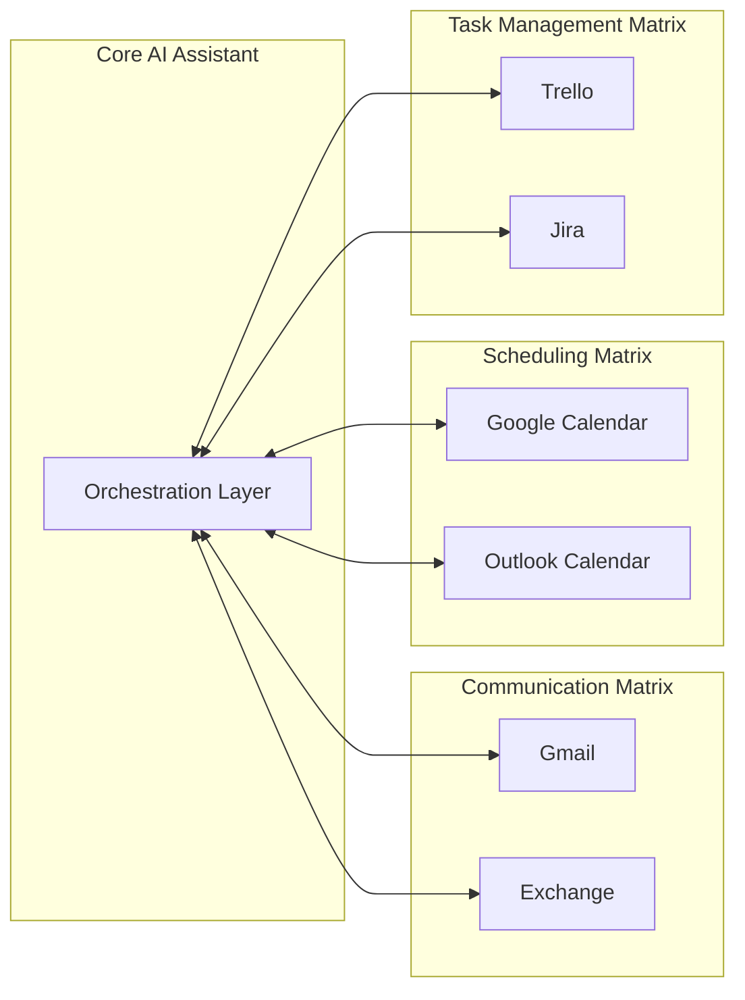
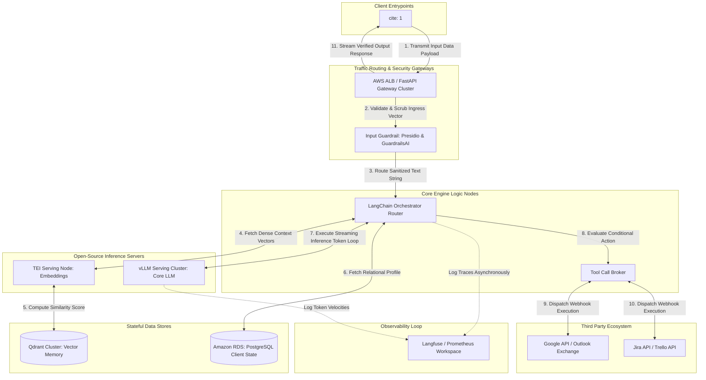

# MERMAID

```mermaid
graph LR
    subgraph Core AI Assistant
        A[Orchestration Layer]
    end
    subgraph Communication Matrix
        B[Gmail]
        C[Exchange]
    end
    subgraph Scheduling Matrix
        D[Google Calendar]
        E[Outlook Calendar]
    end
    subgraph Task Management Matrix
        F[Trello]
        G[Jira]
    end
    A <--> B & C
    A <--> D & E
    A <--> F & G
```

```mermaid
graph TD
    subgraph Client Layer [Client Entrypoints]
        A[Mobile App / Web Dashboard]
    end

    subgraph AWS Cloud Ingress [Traffic Routing & Security Gateways]
        B[AWS ALB / FastAPI Gateway Cluster]
        C[Input Guardrail: Presidio & GuardrailsAI]
    end

    subgraph AWS EKS Orchestration [Core Engine Logic Nodes]
        D[LangChain Orchestrator Router]
        E[Tool Call Broker]
    end

    subgraph AWS Compute Core [Open-Source Inference Servers]
        F[vLLM Serving Cluster: Core LLM]
        G[TEI Serving Node: Embeddings]
    end

    subgraph AWS Storage Tier [Stateful Data Stores]
        H[(Qdrant Cluster: Vector Memory)]
        I[(Amazon RDS: PostgreSQL Client State)]
    end

    subgraph External Networks [Third Party Ecosystem]
        J[Google API / Outlook Exchange]
        K[Jira API / Trello API]
    end

    subgraph Telemetry Network [Observability Loop]
        L[Langfuse / Prometheus Workspace]
    end

    %% Flow Directions %%
    A -->|1. Transmit Input Data Payload| B
    B -->|2. Validate & Scrub Ingress Vector| C
    C -->|3. Route Sanitized Text String| D
    D <-->|4. Fetch Dense Context Vectors| G
    G <-->|5. Compute Similarity Score| H
    D <-->|6. Fetch Relational Profile| I
    D <-->|7. Execute Streaming Inference Token Loop| F
    D -->|8. Evaluate Conditional Action| E
    E <-->|9. Dispatch Webhook Execution| J
    E <-->|10. Dispatch Webhook Execution| K
    B -->|11. Stream Verified Output Response| A[cite: 1]
    
    %% Operational Metrics Telemetry Traces %%
    D -.->|Log Traces Asynchronously| L
    F -.->|Log Token Velocities| L
```
